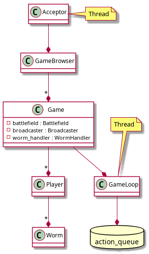

# 
Manual tecnico

# 
Formato de archivos YAML

## Cliente

El formato de client_const.yaml es de la forma 
    
    key: value

## Common

El formato de common_const.yaml es de la forma      
    
    key: value

## Spawn points

El formato de spawn_points.yaml es de la forma 

    map_name:
        - [x_1, y_1]
        - ..
        - [x_n, y_n]

## Server

El formato de server_const.yaml es de la forma 

    key: value

## Player names

El formato de player_names.yaml es de la forma

    worm-names:
        - [name_str_1]
        - ..
        - [name_str_n]

    amount_of_names: n

## level bars

El formato de level_bars.yaml es de la forma

    map_name_bars:
        - [x_1, y_1, angle_1, is_long_1]
        - ...
        - [x_n, y_n, angle_n, is_long_n]

# 
Formato del protocolo

Ambos protocolos (Cliente y Servidor) cuentan con funciones para enviar y recibir 3 tipos de datos basicos, uint8_t (o sus variantes como un enum o bool que ocupen tambien un byte), float y string64. Esto con el fin de enviar los States incluidos en States.h

Tomemos de ejemplo el state LevelStateG, el cual contiene el atributo map_name el cual es un string64, amount_of_bars el cual es un uint8_t y el vector bars el cual contiene objetos de tipo BarDto los cuales incluyen el tipo de barra, la posicion y su angulo siendo estos dos ultimos floats.

Como se menciono antes, para enviar y recibir estos tipos de dato existen metodos definidos. Pero para enviar uint8_t por ejemplo, al no necesitar un cambio de endianess u algun tratamiento especial, es enviado a traves del metodo generico **send**. Para recibirlo en cambio, se implemento un metodo para retornarlo como copia.

## Breve descripcion de states:

CrateState: Contiene el estado de una caja de suministros

GameInfoL: Contiene el estado para visualizar un lobby en el GameSearcher de QT

PlayerStateL: Contiene el estado del jugador en el lobby

LevelStateG: Contiene el estado de todas las barras del mapa

PlayerStateG: Contiene toda la informacion del jugador durante el juego

WormStateG: Contiene toda la informacion de un worm

BattlefieldStateG: Contiene informacion adicional del mapa que se renueva periodicamente

ProjectileStateG: Contiene toda la informacion de un proyectil

PlayerTurn: Contiene la informacion para notificar si es su turno a un jugador

YouWin: Contiene la informacion para comunicar al jugador si gano la partida o perdio

GamesCountL: Contiene la cantidad de juegos en lobby que contiene el game browser

PlayerCountL: Contiene la cantidad de jugadores en el lobby

ProjectileCount: Contiene la cantidad de proyectiles en el juego

CrateCount: Contiene la cantidad de cajas de provisiones en el juego

GameNotJoinable: Contiene una cantidad dummy de Games disponibles con el objetivo de no unirse al juego

ConnectionError: Contiene una cantidad dummy de Games disponibles con el objetivo de no unirse al juego o salirse de el

# 
Diagramas

## Arquitectura de la comunicacion

Ambos clientes, tanto del lado del cliente como del servidor envian y reciben los states de manera asincronica.

## Arquitectura del monitor de juegos

En cada step el gameloop popea de action_queue una accion recibida a ejecutar.

## Recibo de una accion del lado del servidor

Una vez recibida esta accion, el gameloop puede popearla de la queue y ejecutarla.

## Explosion de un proyectil por tiempo

El metodo "collide" actua de misma manera independientemente del comportamiento del proyectil, ya sea unicamente explotar por tiempo o por colision.